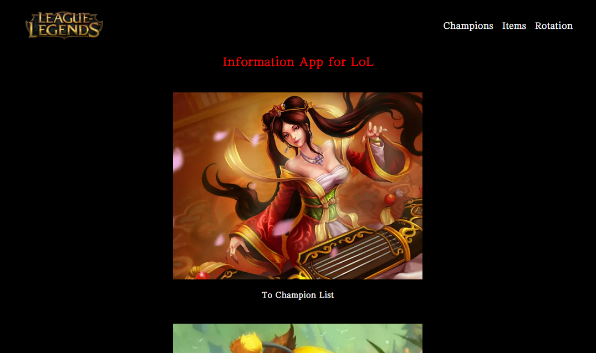
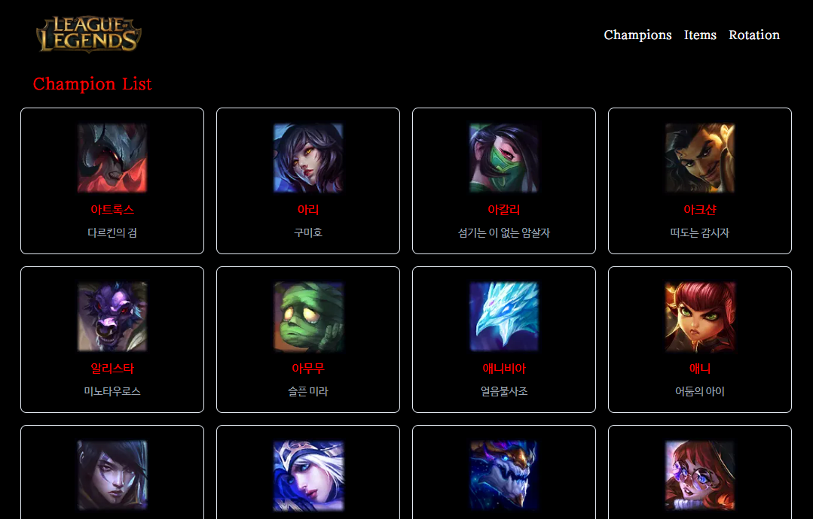
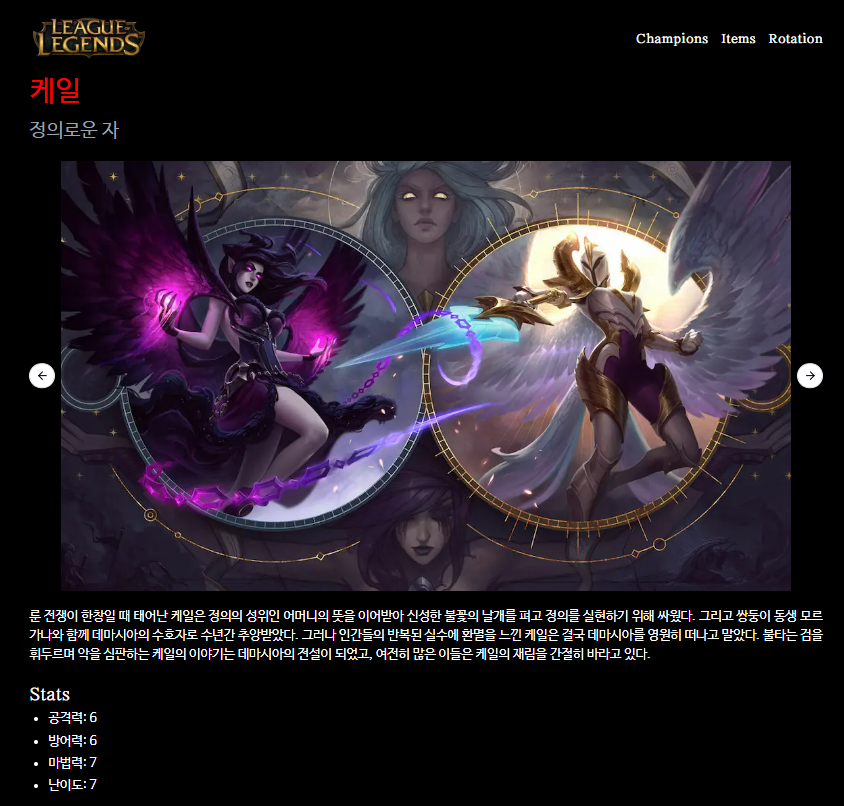
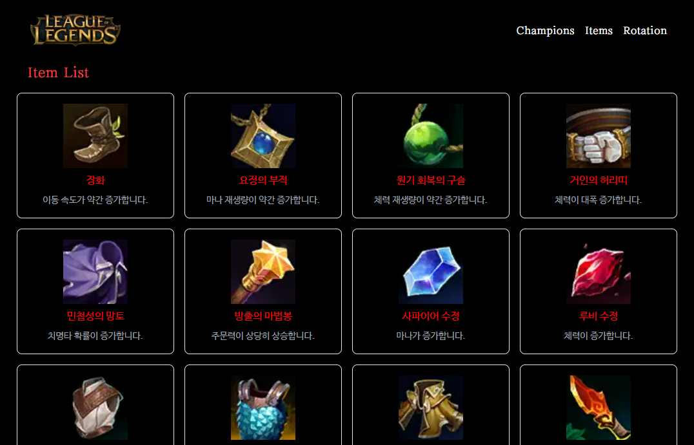
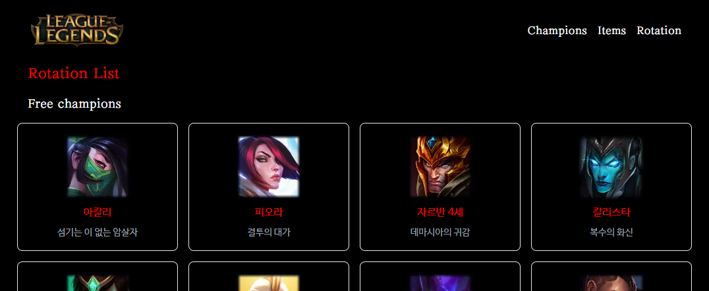

# LoL Dex

'리그 오브 레전드'의 챔피언, 아이템, 금주 로테이션에 대한 정보를 제공합니다.

URL: https://lol-1ezpiq6pf-joycie416s-projects.vercel.app/

#### 시작 페이지


#### 챔피언 페이지


#### 챔피언 상세 페이지


#### 아이템 페이지


#### 로테이션 페이지


## 📚 STACKS

<!-- <div align=Left> -->


<!-- </div> -->

## 설치 패키지

- 프로젝트 세팅 : `npx create-next-app@latest`
  - 실행 : `yarn dev`
- shadcn (UI 라이브러리)의 캐러셀 설치(Embla 기반) : `npx shadcn@latest add carousel`
  - Which style would you like to use? › Default
  - Which color would you like to use as base color? › Slate
  - Do you want to use CSS variables for colors? › yes

## 🗂️ 기능 설명

이번 프로젝트는 Next.js와 TypeScript를 경험해보는 것에 의의를 가짐. 따라서 다양한 렌더링 방식을 사용함.

#### 시작 페이지

- SSG.
- 각 페이지로 이동할 수 있는 `Link` 태그 나열

#### 챔피언, 아이템 페이지

- 전체 챔피언 카드를 grid로 나열
- 챔피언 페이지는 24시간마다 revalidate하는 ISR, 아이템 페이지는 SSG.

1. Riot API에서 데이터 가져오기

```tsx
const URL = `https://ddragon.leagueoflegends.com/cdn/14.19.1/data/ko_KR/${
  "champion" / "item"
}.json`;

export async function getChampions(): Promise<[string, CType][] | null> {
  try {
    const res = await fetch(URL, {
      method: "GET",
      headers: {
        "Content-Type": "application/json",
      },
      next: {
        revalidate: 24 * 60 * 60, // 24시간
      },
    });
    const { data } = await res.json();
    return Object.entries(data);
  } catch (err) {
    console.error(err);
    return null;
  }
}
```

#### 챔피언 상세 페이지

- 브라우저에서 상호작용이 가능한 캐러셀은 client component, 기본 틀은 SSG.
- 특정 챔피언 정보를 가져와 보여줌.
- 모든 스킨에 대한 이미지를 캐러셀로 보여줌.

1. 챔피언 이름에 대해 동적 라우팅 (`/champions/id`) 및 메타 데이터 생성

```tsx
export const generateMetadata = async ({ params }: Params) => {
  const id = params.id;
  const data = await getChampion(id);
  return {
    title: data?.name ?? id,
    description: data?.name,
    image: `https://ddragon.leagueoflegends.com/cdn/14.19.1/img/champion/${id}.png`,
  };
};

const ChapionDetailPage = async ({ params }: Params) => {
  const id = params.id
  const data = await getChampion(id);

  return (
    ...
  )
};
```

2. Riot API에서 데이터 가져오기

```tsx
// Get data of certain champion
const CHAMPION_URL =
  "https://ddragon.leagueoflegends.com/cdn/14.19.1/data/ko_KR/champion";
export async function getChampion(name: string): Promise<SType> {
  const res = await fetch(CHAMPION_URL + `/${name}.json`, {
    method: "GET",
    headers: {
      "Content-Type": "application/json",
    },
  });

  if (res.ok) {
    const { data } = await res.json();
    return data[name];
  } else {
    console.error(new Error("Fail to fetch champion data"));
    throw new Error("Fail to fetch champion data");
  }
}
```

3. `shadcn` 라이브러리를 사용해 챔피언 스킨 이미지 캐러셀로 보여주기

- `loop: true`, `stopOnInteraction: false` 옵션 추가해 회전하며 마우스가 캐러셀에서 사라지면 다시 자동 재생되도록 함
- 그런데 `playOnInit: true` 옵션을 주어도 시작 시 자동 재생되지 않는 문제가 있음.
- 버튼으로 캐러셀을 넘기면 자동 재생이 멈추는 문제가 있음. 마우스로 넘기면 자동 재생 됨.

<br>

4. 존재하지 않는 챔피언 이름으로 상세페이지 접근 시 미들웨어를 통해 챔피언 페이지로 redirect

```ts
// ./src/middleware.ts
import { NextRequest, NextResponse } from "next/server";
import { CHAMPION_NAMES } from "./types/champions";

export function middleware(request: NextRequest) {
  // 만약 챔피언 목록에 없는 경로로 진입할 시 '/champions'로 redirect 하게 해줌
  if (!CHAMPION_NAMES.includes(request.nextUrl.pathname.split("/")[2])) {
    return NextResponse.redirect(new URL("/champions", request.url));
  }
}

export const config = {
  matcher: "/champions/:path+", // '/champions' 이후에 적어도 한 개의 segment가 존재해야 함.
};
```


#### 로테이션 페이지

- CSR.


```tsx
'use client'

const RotationPage = () => {
  const [rotation, setRotation] = useState<CType[][]>([]);

  useEffect(() => {
    const fetchData = async () => {
      const res = await fetch("/api/rotation", { method: "GET" });
      const { data } = await res.json();

      setRotation(data);
    };
    fetchData();
  }, []);
  return (
    <>
      <p className="page-title text-white text-xl ml-4 mb-4">Free champions</p>
      <div className="card-container">
        {rotation[0]?.map((info) => {
          return (
            <Card
              type={"champion"}
              name={info.id}
              title={info.name}
              text={info.title}
              key={info.name}
            />
          );
        })}
      </div>
      <p className="page-title text-white text-xl ml-4 my-4">
        Free champions for new players
      </p>
      <div className="card-container">
        {rotation[1]?.map((info) => {
          return (
            <Card
              type={"champion"}
              name={info.id}
              title={info.name}
              text={info.title}
              key={info.name}
            />
          );
        })}
      </div>
    </>
  );
};

export default RotationPage;
```


## 💥 Trouble Shooting

트러블 슈팅과 좀더 자세한 구현 설명은 [블로그](https://joycie416.tistory.com/entry/Nextjs-%EB%A6%AC%EA%B7%B8%EC%98%A4%EB%B8%8C%EB%A0%88%EC%A0%84%EB%93%9C-%EC%B1%94%ED%94%BC%EC%96%B8-%EC%95%84%EC%9D%B4%ED%85%9C-%EC%A0%95%EB%B3%B4-%EC%A0%9C%EA%B3%B5%ED%95%98%EB%8A%94-%EC%82%AC%EC%9D%B4%ED%8A%B8-%EB%A7%8C%EB%93%A4%EA%B8%B0)를 참고하시기 바랍니다.